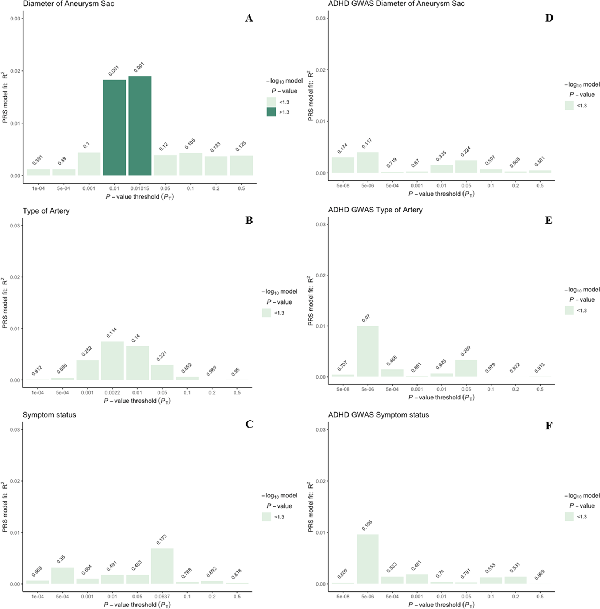
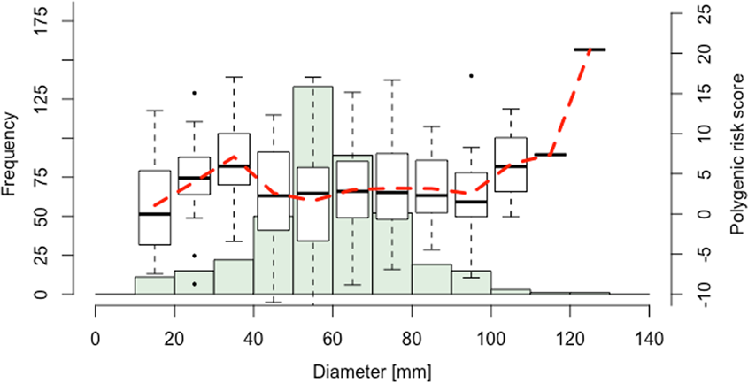

Polygenic Susceptibility of Aortic Aneurysms Associates to the Diameter of the Aneurysm Sac: The Aneurysm-Express Biobank Cohort
===========================================================

#### This readme
This readme accompanies the paper "Polygenic Susceptibility of Aortic Aneurysms Associates to the Diameter of the Aneurysm Sac: The Aneurysm-Express Biobank Cohort." by [Van Laarhoven C.J.H.C.M. _et al_. **Sci Rep 2019**](https://doi.org/10.1038/s41598-019-56230-3).

#### Abstract
Recent genome-wide association studies (GWAS) have discovered ten genetic risk variants for abdominal aortic aneurysms (AAA). To what extent these genetic variants contribute to the pathology of aneurysms is yet unknown. The present study aims to investigate whether genetic risk variants are associated with three clinical features: diameter of aneurysm sac, type of artery and aneurysm related-symptoms in aortic and peripheral aneurysm patients. Aneurysm tissue of 415 patients included in the Aneurysm-Express biobank was used. A best-fit polygenic risk score (PRS) based on previous GWAS effect estimates was modeled for each clinical phenotype. The best-fit PRS (including 272 variants at _P_T = 0.01015) showed a significant correlation with aneurysm diameter (R2 = 0.019, _p_ = 0.001). No polygenic association was found with clinical symptoms or artery type. In addition, the ten genome-wide significant risk variants for AAA were tested individually, but no associations were observed with any of the clinical phenotypes. All models were corrected for confounders and data was normalized. In conclusion, a weighted PRS of AAA susceptibility explained 1.9% of the phenotypic variation (_p_ = 0.001) in diameter in aneurysm patients. Given our limited sample size, future biobank collaborations need to confirm a potential causal role of susceptibility variants on aneurysmal disease initiation and progression.

#### Analysis Scripts
Surely these scripts will not work immediately on your systems, but they may be used and edited for local use. `readme` files are available in the respective folders. 

#### Notes
Scripts will work within the context of a certain Linux environment, for example a CentOS7 system on a SUN Grid Engine background or macOS X Lion+ (version 10.7.[x]+). 

--------------

#### The MIT License (MIT)
##### Copyright (c) 1979-present Sander W. van der Laan | s.w.vanderlaan [at] gmail [dot] com.

Permission is hereby granted, free of charge, to any person obtaining a copy of this software and associated documentation files (the "Software"), to deal in the Software without restriction, including without limitation the rights to use, copy, modify, merge, publish, distribute, sublicense, and/or sell copies of the Software, and to permit persons to whom the Software is furnished to do so, subject to the following conditions:   

The above copyright notice and this permission notice shall be included in all copies or substantial portions of the Software.

THE SOFTWARE IS PROVIDED "AS IS", WITHOUT WARRANTY OF ANY KIND, EXPRESS OR IMPLIED, INCLUDING BUT NOT LIMITED TO THE WARRANTIES OF MERCHANTABILITY, FITNESS FOR A PARTICULAR PURPOSE AND NONINFRINGEMENT. IN NO EVENT SHALL THE AUTHORS OR COPYRIGHT HOLDERS BE LIABLE FOR ANY CLAIM, DAMAGES OR OTHER LIABILITY, WHETHER IN AN ACTION OF CONTRACT, TORT OR OTHERWISE, ARISING FROM, OUT OF OR IN CONNECTION WITH THE SOFTWARE OR THE USE OR OTHER DEALINGS IN THE SOFTWARE.

Reference: http://opensource.org.
